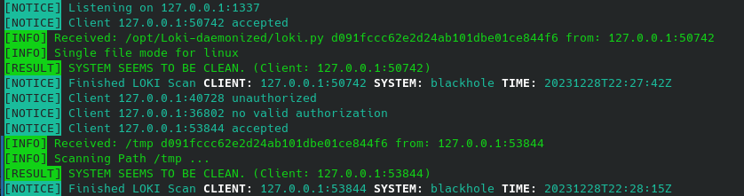

## Loki (daemonized) - Simple IOC and YARA Scanner fork

A fork of [Loki - Simple IOC and YARA Scanner](https://github.com/Neo23x0/Loki), modified to support single file scan, as well as a daemon mode to accept scans in client/server manner. It also includes some [other improvements](#Changes) and is mainly focused on Linux.

The idea is that we can load all the rules once and then perform only individual file scans, which significantly reduces the load on hardware resources. This way, we can use Loki to scan, for example, files uploaded to the server.

Modifications tries to preserve original functionality, although I only care about Linux, so I do not guarantee compatibility with other platforms.

## Dependencies

[Python3](https://www.python.org/) | [colorama](https://pypi.org/project/colorama/) | [future](https://pypi.org/project/future/) | [netaddr](https://pypi.org/project/netaddr/) | [psutil](https://pypi.org/project/psutil/) | [rfc5424-logging-handler](https://pypi.org/project/rfc5424-logging-handler/) | [yara-python](https://pypi.org/project/yara-python/)

#### Alpine Linux

```
apk add bash curl git python3 python3-dev py3-pip gcc musl-dev linux-headers openssl-dev wget
```

#### Void Linux

```
xbps-install -Sy bash curl git python3 python3-devel python3-pip python3-virtualenv openssl-devel gcc wget
```

#### Debian / Ubuntu

```
apt -y install bash curl git python3 python3-dev python3-pip python3-venv libssl-dev wget
```

## Installation

#### Manual

```bash
cd /opt
git clone https://github.com/c0m4r/Loki-daemonized.git
cd Loki-daemonized
python3 -m venv .
. bin/activate
pip3 install -r requirements.txt
./loki-upgrader.py --sigsonly --nolog
python3 loki.py --nolog --intense --force -p ./test
deactivate
```

#### Docker

This repo comes with docker-compose.yml and Dockerfile, based on [official python image](https://hub.docker.com/_/python), so running in docker should be as simple as:

```
git clone https://github.com/c0m4r/Loki-daemonized.git
cd Loki-daemonized
docker compose up
```

However, to be able to scan anything outside docker you have to mount a volume pointing to a specific directory. Change docker-compose.yml accordingly.

There are also [other examples](/docker) available of Docker setup, based on diffrent Linux distros.

#### Chroot

For older systems that can't handle modern deps, you might give it a try: [Loki‐daemonized in chroot](https://github.com/c0m4r/Loki-daemonized/wiki/Loki%E2%80%90daemonized-in-chroot)

## Patch file

Patch file contains changes made to original loki.py.

To apply the patch on original Loki you have to convert loki.py before and after due to DOS line-ending characters used by original author, which the patch does not have.

```bash
wget https://github.com/Neo23x0/Loki/blob/5b7175882a9b7247714b47347c2f9dccdf38d894/loki.py
dos2unix loki.py
patch < loki-daemonized.patch
unix2dos loki.py
```

## Daemonized usage

#### Daemon (server)

Start as a daemon and bind on default localhost:1337

```bash
cd Loki-daemonized
. bin/activate
python3 loki.py -d -s 20000 --noindicator --csv --nolog --intense --force &> loki.log &
deactivate
```

You can also change default bind address/port with `--listen-host` and `--listen-port` args. Check `--help` for details.

Check example [init files](/etc) for OpenRC and systemd integration.

#### Client

```
python3 loki_client.py /path/to/scan
```

## Changes

* Focuses on Linux
* Single file scan if given path is a file
* Daemon mode `-d` with listening socket `--listen-host 127.0.0.1` `--listen-port 1337` accepting scans requested from loki_client.py
* PID file `loki.pid` is created in the program directory if running in daemon mode, you change its path with `--pidfile /path/to/pidfile`
* Optional auth key `--auth somethingRandomHere` in daemon mode (just a dumb string authorization, can be intercepted and read from the process list)
* You can disable one or more yara files, f.e. `--disable-yara-files apt_vpnfilter.yar,yara_mixed_ext_vars.yar`
* Exclude files by hash as proposed by [rafaelarcanjo](https://github.com/rafaelarcanjo) in [Neo23x0/Loki/pull/204](https://github.com/Neo23x0/Loki/pull/204). See: [/config/excludes.cfg](/config/excludes.cfg)
* Initial implementation of process scanning under Linux (scan_processes_linux()):
  * File Name Checks: works with signature-base/iocs/filename-iocs.txt (note: linux iocs missing by default)
  * Process connections: for now, it only shows detected connections per process
  * Process Masquerading Detection: reports non-empty /proc/PID/maps of processess that uses square brackets in their cmdlines

Derived from https://github.com/Neo23x0/Loki/blob/5b7175882a9b7247714b47347c2f9dccdf38d894/loki.py

#### New arguments

```
  -d                    Run as a daemon
  --pidfile PIDFILE     Pid file path (default: loki.pid)
  --listen-host LISTEN_HOST
                        Listen host for daemon mode (default: localhost)
  --listen-port LISTEN_PORT
                        Listen port for daemon mode (default: 1337)
  --auth AUTH           Auth key, only in daemon mode
  --disable-yara-files DISABLE_YARA_FILES
                        Comma separated list of yara files to disable
```

Diff: [loki-daemonized.patch](loki-daemonized.patch)

## Screenshots


With auth:



---
## Licensed under GPL 3.0
* Loki - Simple IOC Scanner Copyright (c) 2015 Florian Roth
* Loki (daemonized) - Simple IOC and YARA Scanner fork (c) 2023 c0m4r

This program is free software: you can redistribute it and/or modify it under the terms of the GNU General Public License as published by the Free Software Foundation, either version 3 of the License, or (at your option) any later version.

This program is distributed in the hope that it will be useful, but WITHOUT ANY WARRANTY; without even the implied warranty of MERCHANTABILITY or FITNESS FOR A PARTICULAR PURPOSE. See the GNU General Public License for more details.

You should have received a copy of the GNU General Public License along with this program. If not, see http://www.gnu.org/licenses/
